# SFeaters

# Abstract
San Francisco publishes its restaurant health inspection data in monthly basis. This data set covers the past three years. Based on the violation history, we should be able to tell the future performance of a restaurant.  
The 3 year period was segmented into 6 different ones, and the latest 6 months were used as target. That is, if a restaurant  has one or more violations during the period, it is labeled as “True”.  
This predictor is able to tell if a restaurant will pass or fail the health inspection in the next 6 months with 71.2% accuracy. 
# How does the predictor work?
Data: SF city health inspection (past 3 years)  
The objective of data cleaning was to get the data in the following form.
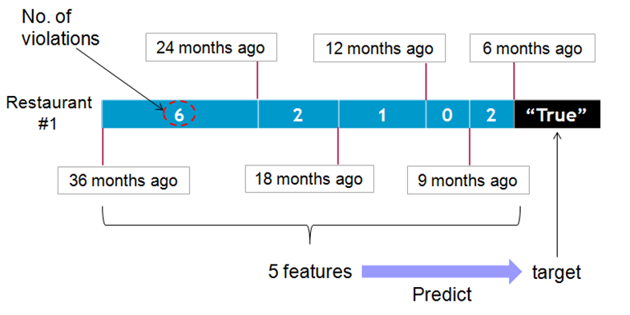
# Data cleaning and EDA
## Features considered  
- 5 periods assigned: 7-9,10-12, 13-15, 16-24, 25-36 month ago  
- Zip codes  
- Yelp customer ratings  
- Yelp food price  
- Business geo coords  
- Business turnover rates  
- Years of restaurant in business
## Sources:
- Yelp ratings and prices: Web-scraping  
- Business geo coords: geopy  
- Business turnover rates and years in business: another dataset from SF city
## Data cleaning pipeline
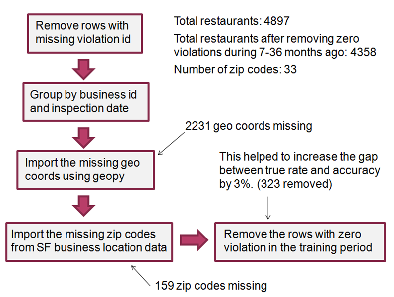
## Scatter plot for different periods
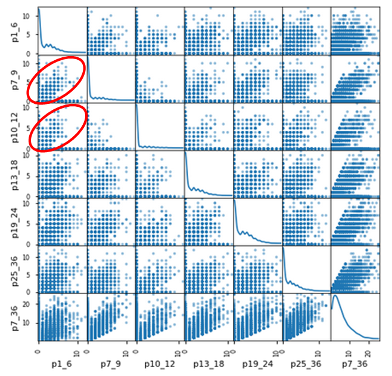
# Modeling
## Algorithms considered:  
1. Logistic regression  
2. Gradient boosting  
3. Decision tree  
4. Random forest  
5. Ada boost  

Gradient boost was slightly better than the rest.  
Accuracy: 71.2%  
Precision: 71.2%  
Recall: 59.1%  
FP rate: 19.1%  
F1: 64.6%  

Class balance (overall true rate) = 44%
## Gradient Boosting  
Final modeling:  
Estimator: 40  
Max feature: 4  
Learning rate: 0.08  
Max depth: 8  
Sub-sample: 0.4  

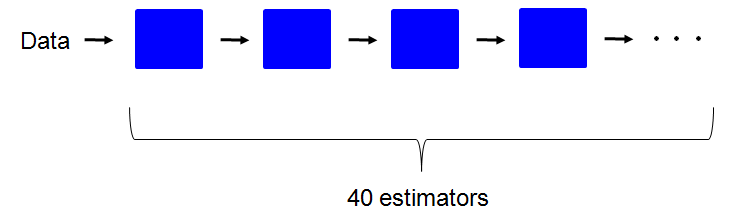
## ROC Curve of Gradient Boosting  
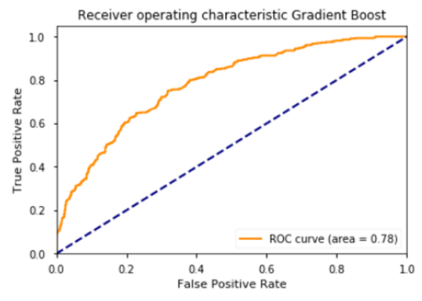
#### AUC = 0.78
## Precision, Recall, F1, Accuracy, & AUC
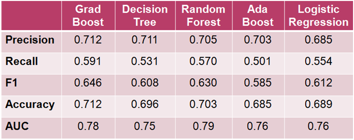  
They perform about the same.  
Gradient boost is slightly better than the rest. (best F1 value) 
## Enemble model
5 models were combined to make a prediction.  
  
Best of 5 wins  -->  70.3% No effect on accuracy  
( performs worse than Grad Boosting, 71.2% )
## Confusion matrix of Gradient Boost
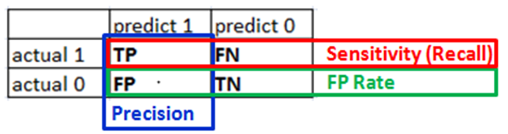
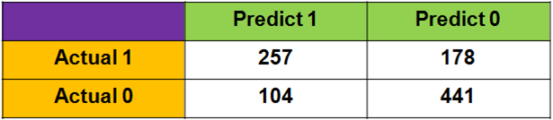  
Precision: 71.2%  
Recall: 59.1%  
FP rate: 19.1%  
F1: 64.6%  
# Analysis
## Missing signatures in violation map
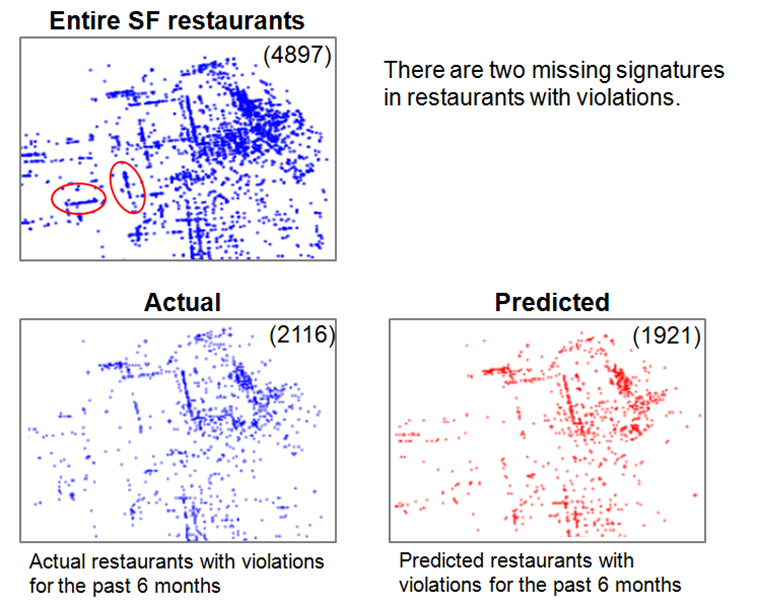
## Two areas without violation signatures 
Below are two areas with signatures shown at entire SF restaurant map, but missing in the violation map.  
The Haight and NoPa areas (Next to Golden Gate Park)  
Why?  
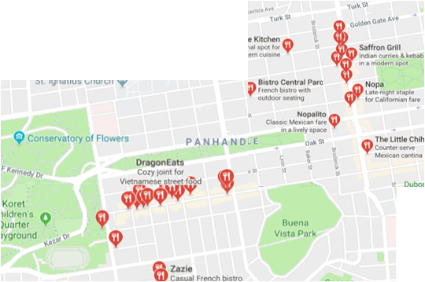
## Histograms for ratings and prices  
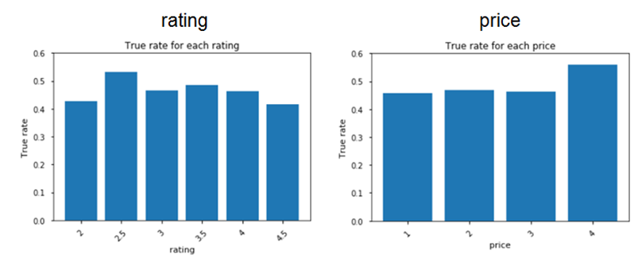  
Customer ratings and food prices have no correlation with food safety.
# Next Steps
1. Restaurant category information from Yelp:
   Type of food: Chinese, French, Mediterranean, seafood, ramen, Southern,  ...
2. Time series analysis on this data.
# Technologies used
* Data process and analysis: Python, SKlearn, Pandas, Matplotlib, GeoPy  
* Website: HTML, Flask, JavaScript  
* Web scraping: MongoDB and BeautifulSoup  
* Cloud computing: AWS, EC2, and S3  
* Data version control: Github  